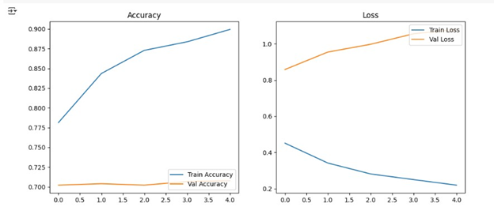
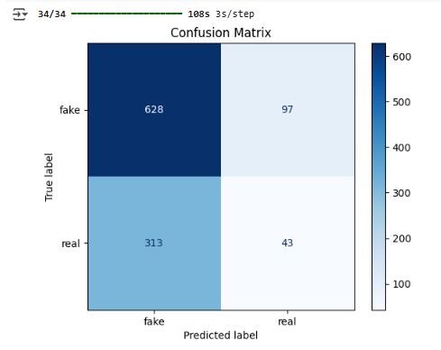
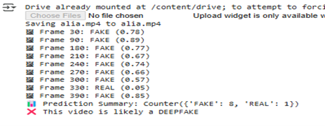

# Deep Fake Video Detection Using Deep Learning

## 📌 Project Overview
This project focuses on detecting deep fake videos by analyzing facial features extracted from video frames using deep learning techniques. The system uses Convolutional Neural Networks (CNNs) with MobileNetV2 transfer learning to classify videos as Real or Fake.

Deep fake videos often contain subtle artifacts such as facial asymmetry, blending errors, unnatural eye movements, and temporal inconsistencies that are difficult for humans to detect. This model learns these hidden patterns to provide reliable video authenticity verification.

---

## 🎯 Objectives
- Detect manipulated (deep fake) videos accurately
- Extract facial features from video frames
- Classify videos as Real or Fake using deep learning
- Provide a scalable and efficient detection pipeline

---

## 🧠 Technologies Used
- Python
- TensorFlow / Keras
- OpenCV
- MobileNetV2 (Transfer Learning)
- Haar Cascade Classifier
- CNN

---

## ⚙️ Methodology
1. Extract frames from input videos at fixed intervals
2. Detect and crop faces using Haar Cascade classifier
3. Preprocess facial images
4. Train CNN model based on MobileNetV2
5. Perform frame-level prediction
6. Use majority voting for final video classification

---

## 📊 Results
- Training Accuracy: ~89.95%
- Validation Accuracy: ~70.77%
- Evaluated using accuracy/loss graphs and confusion matrix
- ## 📸 Sample Outputs

### Accuracy & Loss


### Confusion Matrix


### Real Video Prediction


### Fake Video Prediction



---

## 🏁 Conclusion
The project demonstrates that lightweight deep learning models such as MobileNetV2 can effectively detect deep fake videos with good accuracy while remaining computationally efficient. This system can be extended for real-time detection and deployment in digital forensics and media verification.

---
---

## 🚀 Setup & Usage

### Step 1: Clone the Repository
```bash
git clone https://github.com/ramavathsrujana/deepfakevideodetection.git
cd deepfakevideodetection
```
---

### Step 2: Install Dependencies
Make sure Python (3.8 or higher) is installed, then run:
```bash
pip install -r requirements.txt
```
### 🔹 Step 3: Prepare Dataset
```md
### Step 3: Prepare Dataset
Arrange the dataset in the following structure:
dataset/
├── real/
└── fake/


> ⚠️ The dataset is not included in this repository due to size limitations.
```
### Step 4: Train the Model
Run the training script:
```bash
python src/train_model.py
```
### Step 5: Predict on a Video
Place a video file (e.g., `sample.mp4`) in the project directory and run:
```bash
python src/predict_video.py

```
